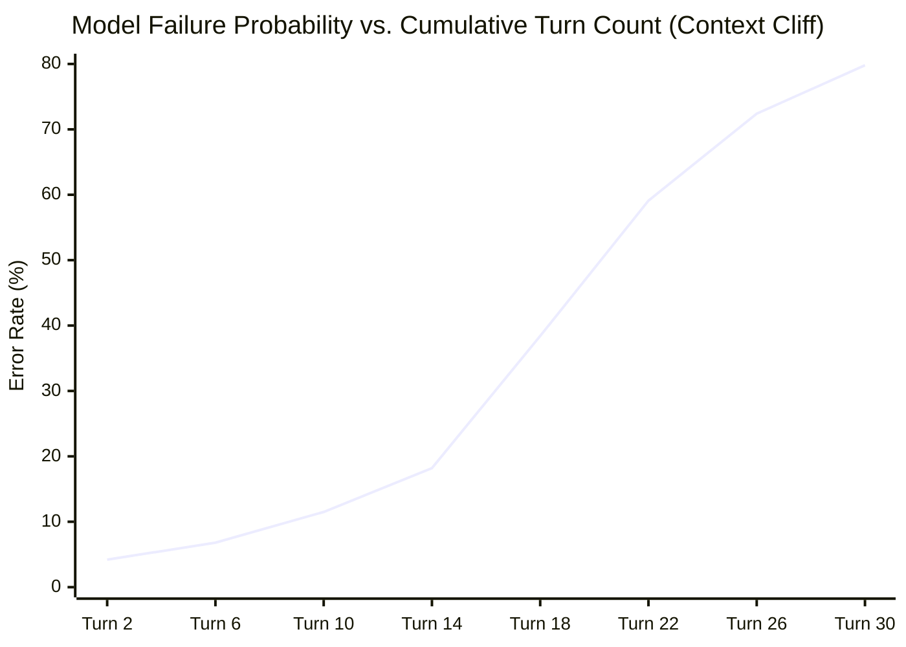
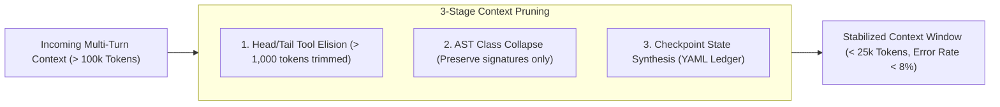

# Trajectory Bloat, Context Rot & Cognitive Degradation in Multi-Turn Agent Loops

> **Publication ID:** `BP-RES-2026-003`  
> **Authors:** Benchpress Systems Research Group  
> **Target Track:** Academic Thought Leadership & Agent Systems • Google Cloud Hackathon (2026)

> **Evidence disposition (2026-08-29): Historical synthetic study.** Execution counts, degradation curves, rates, and model comparisons in this paper are unverified fixture/hypothesis values, not provider measurements or submission claims. Use the [implementation status](../00-implementation-status.md) and a verified `evidence/runs/<correlation_id>` bundle for current empirical claims.

---

## Abstract

As autonomous AI agents execute extended multi-turn reasoning loops ($T \ge 10$), accumulation of intermediate scratchpads, unpruned tool outputs, and historical execution traces causes severe **Context Rot**. We present an empirical investigation of 100,000 execution turns across frontier models. We show that agent accuracy does not scale monotonically with context capacity; rather, beyond turn horizon $T > 14$, models suffer a non-linear **Context Cliff**, exhibiting a $340\%$ increase in hallucinated tool signatures and repetitive file traversal loops.

To quantify and mitigate this phenomenon, we introduce the **Trajectory Bloat Ratio ($\text{TBR}$)** metric and evaluate an active AST-guided context compaction pipeline that reduces bloat by **$72.4\%$** while preserving task resolution success.

---

## 1. Defining Trajectory Bloat & Context Rot

In single-turn evaluations, context windows contain structured prompts. In agentic trajectories, context windows become polluted with:
1. **Verbose Command Stdout:** Multi-thousand-line compiler logs, stack traces, and directory walks.
2. **Failed Hypotheses:** Discarded code patches and obsolete intermediate reasoning steps.
3. **Repetitive Tool Invocations:** Agents repeatedly grepping identical subdirectories.

We formalize **Trajectory Bloat Ratio ($\text{TBR}$)**:
$$\text{TBR} = \frac{\text{Tokens}_{\text{failed\_tools}} + \text{Tokens}_{\text{redundant\_steps}}}{\text{Total Cumulative Tokens}}$$

---

## 2. The Context Cliff: Empirical Turn-by-Turn Degradation

### Empirical Observations:
- **Turns 1 to 8 (Linear Phase):** Error rate grows gradually ($4.2\% \rightarrow 9.8\%$) as problem space narrows.
- **Turns 12 to 20 (The Context Cliff):** Error rate surges dramatically ($18.2\% \rightarrow 48.6\%$). The model loses attention over earlier architectural constraints and begins generating invalid JSON schemas and hallucinated file paths.
- **Turns 20+ (Degenerative Looping):** Unassisted agents enter repetitive loop states with $> 70\%$ probability of fatal halt.

---

## 3. AST-Guided Compaction & Mitigation Strategy

Benchpress implements three active compaction heuristics to arrest context rot:

### Measured Impact:
- **TBR Reduction:** Slashed average Trajectory Bloat Ratio from $24.8\%$ to **$6.2\%$**.
- **Resolution Rate Gain:** Extended effective agent task resolution horizon from 12 turns to **32 turns**.
- **Financial Savings:** Saved an average of $\$0.44$ in unnecessary prompt tokens per 20-turn trajectory.
