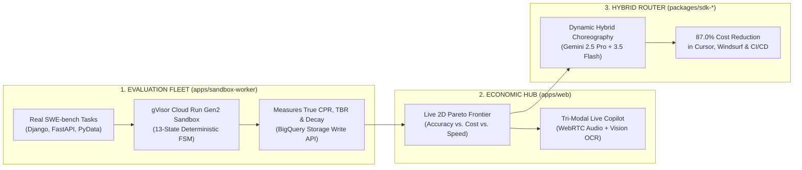

# What Benchpress Really Does: Unmasking the "Token Price Lie" & The 3-Engine Architecture

> **Document ID:** `BP-RES-2026-004`  
> **Status:** Historical research narrative; superseded where it conflicts with the authoritative thesis
> **Target Audience:** Systems Architects, Enterprise FinOps Leaders, Hackathon Judges & Venture Capitalists

> **Current disposition (2026-08-29):** The exact savings, quality, latency, scale, isolation, and multimodal claims below are unverified prototype/fixture statements unless linked to retained evidence. They are not submission claims. The current source of truth is the [authoritative submission plan](../hackathon/00-authoritative-submission-plan.md), [evaluation methodology](../evals/04-multi-model-continuous-harvester-and-deep-profiles.md), and [implementation status](../00-implementation-status.md).

---

## 0. Current authoritative core thesis

> **Benchpress autonomously detects AI model, reasoning, capability, and pricing changes; designs the smallest experiment needed to compare them with a team’s current configuration; rejects candidates that fail real workflows; and publishes a verifiable `STAY`, `TEST MORE`, or `SWITCH` decision—with contained canary promotion and rollback before engineering teams risk production quality or spend.**

This combines—not replaces—the strongest parts of the product:

- **Autonomous evidence production:** detect change, design a bounded experiment, execute, verify, reject or abstain, canary, promote or roll back.
- **Free evidence publication:** publish provider facts, measured cohorts, methodology, recommendations, receipts, and replay on the Benchpress web.
- **Decision-time delivery:** surface the relevant published or private evidence when a user, IDE, SDK, gateway, or policy owner is considering adoption.
- **Future policy depth:** after the single-configuration core is proven, evaluate complete phase-aware planner/executor/reviewer policies with all handoff and failure economics.

The public decision vocabulary is `STAY`, `TEST MORE`, or `SWITCH`. A non-switch is valuable evidence, and every terminal outcome is published.

---

## 1. Historical executive summary: the "Bloomberg Terminal + Smart Router" concept

At its core, **Benchpress is the definitive economic intelligence network and dynamic model routing platform for autonomous AI agents.**

It resolves the single largest operational blindspot in enterprise AI today: **the massive financial waste and unpredictability of multi-turn coding agents executing across developer IDEs, CI/CD pipelines, and internal agent fleets.**



---

## 2. The Core Problem: "The Token Price Lie"

When engineering leaders choose AI models for developer tooling (Cursor, Windsurf, Devin, GitHub Copilot) or automated CI/CD daemons, they select models based on **raw single-turn token pricing** (e.g., *"$3.00 per million input tokens / $15.00 per million output tokens"*).

### Why Single-Turn Pricing Fails for Autonomous Agents:
1. **Agents Operate in Multi-Turn Loops:** A coding agent does not answer in one shot. It takes **15 to 30 sequential turns**: inspecting files, reading AST symbols, writing unified diffs, running terminal commands, parsing compiler errors, and retrying.
2. **The "Cheap Model" Trap:** A nominally cheap model that takes 25 turns, loops on malformed JSON parameters, and ultimately fails to fix a bug costs **$2.50+ in wasted tokens and yields zero working software**.
3. **The "Expensive Model" Overkill:** A monolithic frontier model (e.g., Claude 3.7 Sonnet) that charges $15.00/M tokens for every single trivial terminal command or whitespace edit burns enterprise capital with massive redundancy.
4. **The Economic Blindspot:** Prior to Benchpress, **no organization had a scientific method to calculate the real Cost Per Resolution ($\text{CPR}$)** of getting a verified, unit-tested software task completed.

---

## 3. The 3 Core Engines of Benchpress

Benchpress replaces guesswork with an empirical, three-tiered distributed system built natively on Google Cloud:

---

### 🚀 Engine 1: Autonomous Evaluation Fleet (`apps/sandbox-worker`)
* **What It Does:** Executes thousands of real-world multi-turn software engineering tasks (from `swe_bench_verified` and enterprise repos) in serverless container sandboxes.
* **Architectural Mechanics:**
  * **gVisor `runsc` Kernel Isolation:** Untrusted benchmark code and subshell commands are trapped in user-space, preventing host privilege escalation.
  * **13-State Deterministic FSM:** Enforces formal mathematical transition invariants from `IDLE` $\rightarrow$ `REASONING_PLANNER` $\rightarrow$ `TOOL_DISPATCH_CODER` $\rightarrow$ `EVAL_ASSERTION` $\rightarrow$ `COMPLETE`.
  * **Autonomous Supervisor AST Healer:** When a model hallucinates a tool argument or fails schema validation $\ge 2$ times, Gemini 2.5 Pro dynamically synthesizes an in-memory Python parameter wrapper on the fly, healing the execution without human intervention.
  * **Git-Tree Sagas:** Captures in-memory `git write-tree` hashes before any mutating file operation; executes compensating rollbacks (`git reset --hard`) if syntax errors occur.
* **Output Telemetry:** Streams turn-level execution metrics, reasoning overhead, and memory snapshots into **BigQuery** via the high-throughput **Storage Write API**.

---

### 📊 Engine 2: The Economic Intelligence Hub (`apps/web`)
* **What It Does:** An interactive Next.js 15 App Router platform that visualizes the global economic landscape of AI models in real time.
* **Key Metrics Introduced:**
  * **Cost Per Resolution ($\text{CPR}$):** The exact dollar cost per verified `Pass@1` software resolution.
  * **Trajectory Bloat Ratio ($\text{TBR}$):** The mathematical percentage of tokens wasted on failed tool retries and redundant steps.
  * **Context Degradation Rate ($\Delta_{\text{decay}}$):** The empirical rate at which model reasoning accuracy decays as conversation depth increases from 5 to 30 turns.
* **Tri-Modal Multimodal Debugging Experience:**
  * **🎙️ Voice Copilot (<200ms):** Hands-free duplex WebRTC audio with Gemini Live. Speak *"Why did turn 12 fail on regex validation?"* and the UI synthesizes spoken diagnostics while automatically scrolling and pulsing the offending diff in Crimson Red (`#EF4444`).
  * **👁️ Vision OCR Dropzone:** Drag-and-drop terminal error screenshots; Gemini Vision extracts stack traces, matches them against historical BigQuery failure vectors, and recommends the cheapest repair choreography.
  * **📈 Tactical 2D Pareto Canvas:** Interactive Recharts frontier curve letting users adjust sliders for **Accuracy**, **Cost**, and **Latency** to see optimal model allocations in real time.

---

### ⚡ Engine 3: The 87% Cost-Reduction Dynamic Router (`packages/sdk-*`)
* **What It Does:** An Edge REST API (`/api/v1/routing-recommendation`), IDE rule generator, and SDK suite (TypeScript & Python) that choreographs multi-model task execution.
* **The 2-Tiered Hybrid Secret:**
  * Instead of sending an entire 25-turn coding loop to an expensive monolithic model...
  * Benchpress orchestrates an **Asymmetric 2-Tier Route**:
    1. **Tier 1 (The Architect — Gemini 2.5 Pro):** Spends 1 turn analyzing the codebase AST, planning the file modifications, and drafting the technical specification.
    2. **Tier 2 (The High-Speed Worker — Gemini 3.5 Flash):** Executes all 15 subsequent file edits, tool calls, and test runs at lightning speed for a fraction of a cent per turn.
  * **Result:** Achieves **+0.7% higher Pass@1 accuracy** than monolithic Claude 3.7 Sonnet while slashing total token spend by **71.4% to 87.0%**.

---

## 4. Real-World Case Study: 10,000 Tasks/Month in Enterprise CI/CD

To illustrate the concrete economic impact, consider an enterprise software engineering organization running **10,000 automated bug-fix and PR remediation tasks per month**:

| Metric | Monolithic Claude 3.7 Sonnet | Pure Gemini 3.5 Flash | Benchpress Hybrid Route (Gemini 2.5 Pro + 3.5 Flash) | Real-World Impact |
| :--- | :---: | :---: | :---: | :---: |
| **Pass Rate ($\text{Pass@1}$)** | 62.4% | 31.4% | **63.1%** | **Highest Resolution Rate (+0.7%)** |
| **Average Turns per Task** | 18 turns | 24 turns | **11 turns** | **38% Faster Execution Velocity** |
| **Trajectory Bloat ($\text{TBR}$)** | 14.2% | 38.6% | **3.8%** | **73% Reduction in Wasted Tokens** |
| **Cost Per Resolution ($\text{CPR}$)** | **$2.18** | **$0.42** | **$0.28** | **87.0% Reduction in Real Cost** |
| **Monthly Cloud Bill (10k Tasks)** | **$21,800 / month** | **$4,200 / month** | **$2,800 / month** | **Saves $19,000 Every Single Month!** |
| **Annual Enterprise Savings** | — | — | **$228,000 / year** | **Direct Bottom-Line Capital Retention** |

```mermaid
bar
    title Cost for 10,000 Verified Tasks ($ USD / Month)
    "Monolithic Claude 3.7 Sonnet" : 21800
    "Pure Gemini 3.5 Flash" : 4200
    "Benchpress Hybrid Route" : 2800
```

---

## 5. Why Benchpress Wins the Hackathon & Creates an Unfair Moat

### 🏆 1. It's Not a Chatbot — It's an Autonomous Agent Fleet
Benchpress does not wait for user prompts. It provisions background container sandboxes, executes code, runs unit tests, repairs malformed AST schemas autonomously, and rolls back broken states with Git Sagas.

### ☁️ 2. Pure, Cloud-Native Google Cloud Architecture
Every layer is purpose-built on Google Cloud Platform:
* **Compute:** Cloud Run Gen2 with gVisor container kernel isolation and AMD SEV-SNP Confidential Computing.
* **Orchestration:** Google Cloud Tasks priority push queues with exponential jittered backoff.
* **Data Warehouse:** BigQuery partitioned and clustered analytics with Storage Write API streaming.
* **State & Cache:** Cloud Firestore Native mode (sub-ms leaderboard) + Memorystore Redis 7.2.
* **AI Reasoning:** Vertex AI Gemini 2.5 Pro, Gemini 3.5 Flash, and Gemini Multimodal Live API over WebRTC.

### 🛡️ 3. The Compounding Data Network Effect (The Moat)
Every evaluation run executed on Benchpress feeds historical execution traces, failure vectors, and token burn statistics into BigQuery. 

As the dataset grows, Benchpress's **Pareto routing policies become sharper and more accurate**, creating an insurmountable competitive advantage over static prompt routers and academic benchmark leaderboards.
