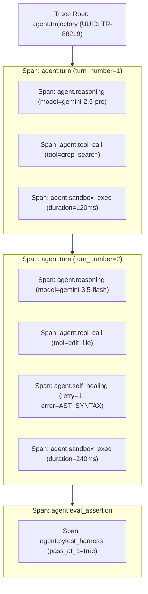

# OpenTelemetry Semantic Conventions for Autonomous AI Agents

> **Document ID:** `BP-TEL-001`  
> **Status:** Approved / Production  
> **Target Track:** Observability, FinOps & Architecture • Google Cloud Hackathon (2026)

---

## 1. OpenTelemetry Semantic Conventions Overview

Standard OpenTelemetry HTTP and database spans are insufficient for autonomous AI agent architectures. An agentic trace involves multi-turn reasoning, tool execution inside sandboxes, self-healing retries, and token-level financial accounting.

Benchpress establishes the formal **OpenTelemetry GenAI & Agent Semantic Conventions (`gen_ai.*` and `agent.*`)**:



---

## 2. Span Hierarchy & Semantic Attribute Specifications

### 2.1 Span: `agent.trajectory`
The root span encompassing the entire multi-turn benchmark run.

| Attribute Key | Type | Description | Example |
| :--- | :--- | :--- | :--- |
| `agent.trajectory_id` | `string` | Globally unique run UUID | `"tr_992140a"` |
| `agent.task_id` | `string` | Benchmark task identifier | `"django__django-11099"` |
| `agent.suite` | `string` | Benchmark suite name | `"swe_bench_verified"` |
| `agent.model_routing_tier`| `string` | Routing choreography type | `"HYBRID_2.5_3.5"` |
| `agent.total_turns` | `int` | Total turns executed | `4` |
| `agent.total_cost_usd` | `double` | Total dollar cost incurred | `0.0245` |
| `agent.cpr_usd` | `double` | Computed Cost Per Resolution | `0.0245` |
| `agent.pass_at_1` | `boolean`| Ground-truth resolution outcome | `true` |
| `agent.bloat_ratio` | `double` | Trajectory Bloat Ratio | `0.042` |

---

### 2.2 Span: `agent.turn`
Child span representing a single perceive-reason-act-evaluate turn.

| Attribute Key | Type | Description | Example |
| :--- | :--- | :--- | :--- |
| `agent.turn_number` | `int` | Sequential turn index | `2` |
| `gen_ai.system` | `string` | Model provider platform | `"gcp.vertex_ai"` |
| `gen_ai.request.model` | `string` | Foundation model ID | `"gemini-3.5-flash"` |
| `gen_ai.usage.input_tokens` | `int` | Input token count | `1420` |
| `gen_ai.usage.output_tokens`| `int` | Generated output tokens | `310` |
| `gen_ai.usage.reasoning_tokens`| `int`| Internal CoT reasoning tokens | `0` |
| `gen_ai.turn_cost_usd` | `double` | Dollar cost for this turn | `0.0012` |
| `agent.fsm_state` | `string` | Active FSM state | `"TOOL_INVOCATION"` |

---

### 2.3 Span: `agent.tool_call` & `agent.sandbox_exec`
Granular spans tracking AST tool validation and isolated kernel execution.

| Attribute Key | Type | Description | Example |
| :--- | :--- | :--- | :--- |
| `agent.tool.name` | `string` | Name of invoked tool | `"edit_file"` |
| `agent.tool.is_schema_valid`| `boolean`| Did arguments match Pydantic schema | `true` |
| `agent.tool.is_hallucinated`| `boolean`| Was tool name non-existent | `false` |
| `agent.sandbox.runtime` | `string` | Sandbox virtualization type | `"gvisor.runsc"` |
| `agent.sandbox.exit_code` | `int` | Process exit code | `0` |
| `agent.sandbox.stdout_bytes`| `int` | Size of returned output | `428` |

---

## 3. Python OpenTelemetry Instrumentation Implementation

```python
# File: benchpress/telemetry/otel_tracer.py
from opentelemetry import trace
from opentelemetry.trace import Status, StatusCode
from typing import Dict, Any

tracer = trace.get_tracer("benchpress.agent.runtime", "1.0.0")

class AgentTurnSpan:
    def __init__(self, trajectory_id: str, turn_number: int, model_id: str):
        self.trajectory_id = trajectory_id
        self.turn_number = turn_number
        self.model_id = model_id
        self.span = None

    def __enter__(self):
        self.span = tracer.start_span(
            f"agent.turn:{self.turn_number}",
            attributes={
                "agent.trajectory_id": self.trajectory_id,
                "agent.turn_number": self.turn_number,
                "gen_ai.system": "gcp.vertex_ai",
                "gen_ai.request.model": self.model_id,
            }
        )
        return self

    def record_usage(self, in_tokens: int, out_tokens: int, cost_usd: float):
        if self.span:
            self.span.set_attribute("gen_ai.usage.input_tokens", in_tokens)
            self.span.set_attribute("gen_ai.usage.output_tokens", out_tokens)
            self.span.set_attribute("gen_ai.turn_cost_usd", cost_usd)

    def record_self_healing(self, error_code: str, retry_count: int):
        if self.span:
            self.span.add_event(
                "agent.self_healing_triggered",
                attributes={
                    "error_code": error_code,
                    "retry_count": retry_count
                }
            )

    def __exit__(self, exc_type, exc_val, exc_tb):
        if exc_type:
            self.span.set_status(Status(StatusCode.ERROR, str(exc_val)))
        else:
            self.span.set_status(Status(StatusCode.OK))
        self.span.end()
```
