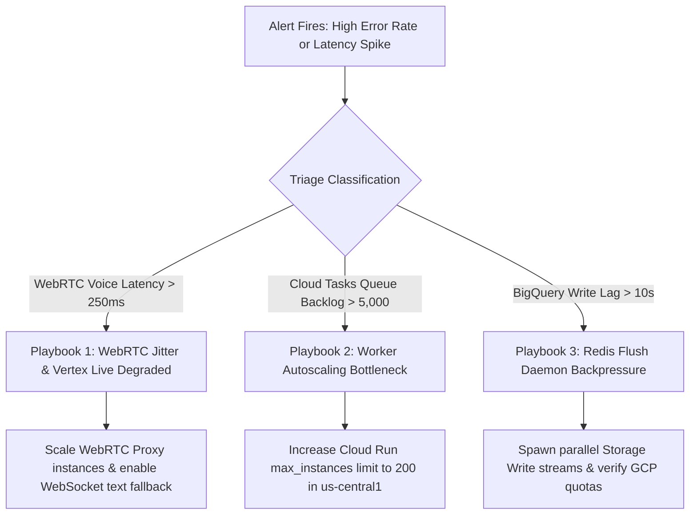

# Cloud Monitoring Dashboards, SLOs & Alerting Policies

> **Document ID:** `BP-TEL-003`  
> **Status:** Historical target-state design — not deployed or verified
> **Target Track:** Observability, FinOps & System Architecture • Google Cloud Hackathon (2026)

---

## 1. Service Level Objectives (SLOs) & Reliability Targets

Benchpress enforces strict enterprise reliability and performance SLOs across all services:

| Service Boundary | Metric Indicator (SLI) | Target Objective (SLO) | Measurement Window |
| :--- | :--- | :--- | :--- |
| **Model Routing API** | HTTP 200 Availability | **$99.95\%$ Success Rate** | 30-Day Rolling Window |
| **Model Routing Latency** | Request Latency ($P_{95}$) | **$< 150\,\text{ms}$** | 7-Day Rolling Window |
| **Multimodal Live WebRTC** | End-to-End Glass-to-Ear Latency | **$< 200\,\text{ms}$** | 1-Hour Rolling Window |
| **Sandbox Execution Fleet** | Task Dispatch to Worker Boot | **$< 2.0\,\text{seconds}$** | 24-Hour Rolling Window |
| **BigQuery Write Buffer** | Redis Flush Pipeline Lag | **$< 3.0\,\text{seconds}$** | Continuous Real-Time |

---

## 2. Production Terraform Alerting Policies

The following Terraform HCL establishes Google Cloud Monitoring alerting policies with automated incident dispatch to PagerDuty and Slack webhooks:

```hcl
# File: terraform/monitoring_alerts.tf

# 1. Notification Channels
resource "google_monitoring_notification_channel" "slack_alerts" {
  display_name = "Benchpress Critical SRE Alerts (Slack)"
  type         = "slack"
  labels = {
    channel_name = "#benchpress-prod-alerts"
  }
  sensitive_labels {
    auth_token = var.slack_webhook_auth_token
  }
}

resource "google_monitoring_notification_channel" "pagerduty_sre" {
  display_name = "PagerDuty On-Call SRE Fleet"
  type         = "pagerduty"
  sensitive_labels {
    service_key = var.pagerduty_service_key
  }
}

# 2. Alert: Model Routing API High Error Rate (SLO Breach)
resource "google_monitoring_alert_policy" "api_error_rate_alert" {
  display_name = "CRITICAL: Benchpress API 5xx Error Rate > 1%"
  combiner     = "OR"

  conditions {
    display_name = "Cloud Run API Gateway 5xx rate"
    condition_threshold {
      filter          = "resource.type = \"cloud_run_revision\" AND resource.labels.service_name = \"benchpress-api-gateway\" AND metric.type = \"run.googleapis.com/request_count\" AND metric.labels.response_code_class = \"5xx\""
      duration        = "180s" # 3 minutes continuous
      comparison      = "COMPARISON_GT"
      threshold_value = 0.01
      aggregations {
        alignment_period   = "60s"
        per_series_aligner = "ALIGN_RATE"
      }
    }
  }

  notification_channels = [
    google_monitoring_notification_channel.slack_alerts.id,
    google_monitoring_notification_channel.pagerduty_sre.id
  ]
}

# 3. Alert: WebRTC Multimodal Live Audio Latency Spike (> 250ms)
resource "google_monitoring_alert_policy" "webrtc_latency_alert" {
  display_name = "WARNING: WebRTC Live Audio Latency P95 > 250ms"
  combiner     = "OR"

  conditions {
    display_name = "WebRTC Media Pipeline Latency"
    condition_threshold {
      filter          = "resource.type = \"cloud_run_revision\" AND metric.type = \"custom.googleapis.com/benchpress/webrtc_audio_latency_ms\""
      duration        = "120s"
      comparison      = "COMPARISON_GT"
      threshold_value = 250
      aggregations {
        alignment_period   = "60s"
        per_series_aligner = "ALIGN_PERCENTILE_95"
      }
    }
  }

  notification_channels = [
    google_monitoring_notification_channel.slack_alerts.id
  ]
}

# 4. Alert: Memorystore Redis Telemetry Buffer High Memory (> 80%)
resource "google_monitoring_alert_policy" "redis_buffer_memory_alert" {
  display_name = "WARNING: Memorystore Redis Buffer Memory > 80%"
  combiner     = "OR"

  conditions {
    display_name = "Redis Memory Usage Ratio"
    condition_threshold {
      filter          = "resource.type = \"redis_instance\" AND metric.type = \"redis.googleapis.com/stats/memory/usage_ratio\""
      duration        = "300s"
      comparison      = "COMPARISON_GT"
      threshold_value = 0.80
      aggregations {
        alignment_period   = "60s"
        per_series_aligner = "ALIGN_MEAN"
      }
    }
  }

  notification_channels = [
    google_monitoring_notification_channel.slack_alerts.id
  ]
}
```

---

## 3. Incident Triage Matrix & On-Call Playbooks


